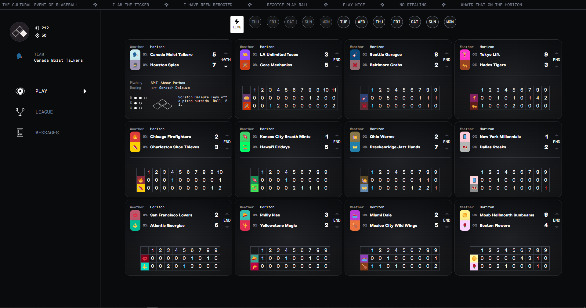

## I made a thing!

## Instructions

* Follow the easy to follow instructions to install the [Stylus](https://github.com/openstyles/stylus) add-on/extension for your browser

* [Click Here to Install Beautified Blaseball](styles/beautified-blaseball.user.css)

## Troubleshooting

* idk it's blaseball it's probably broken

## Recent Updates

* v0.0.1 hopefully it's good!

## Screenshot

### Beautified Blaseball

If you notice any issues feel free to message me at thevdude#6881 on discord and I'll try to take a look at it. :) Stay safe :)
