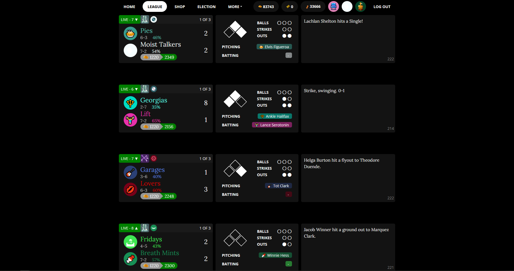
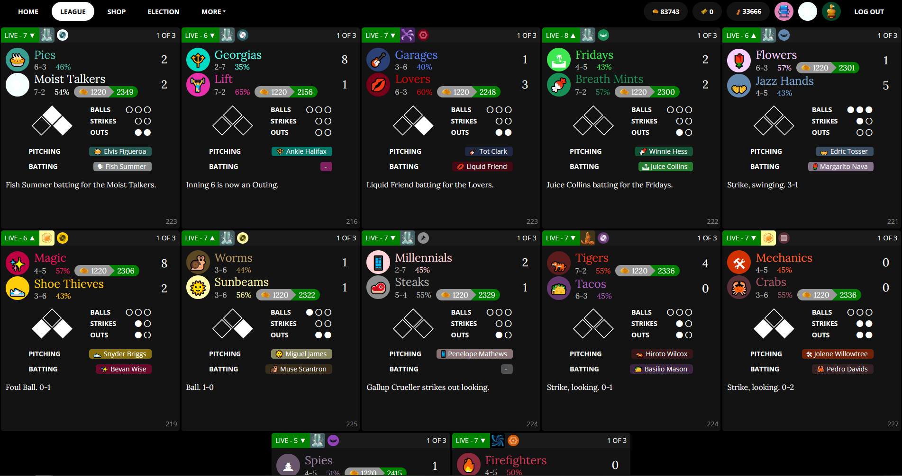
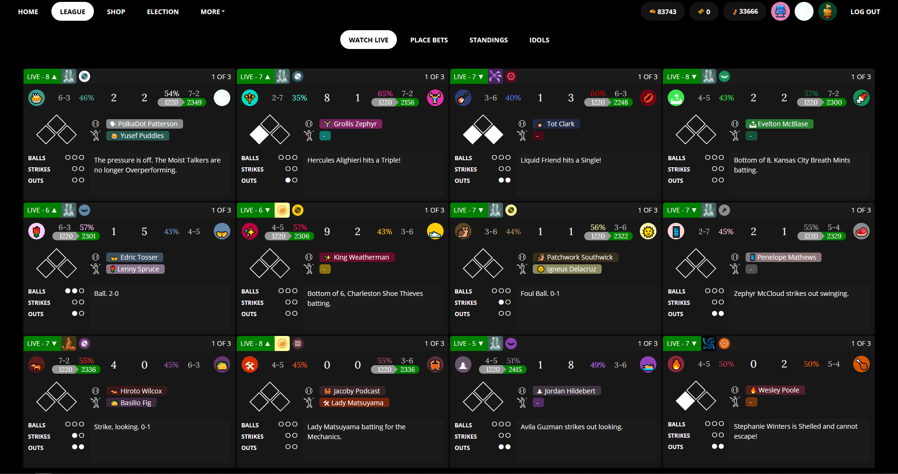

## I made a thing!

I loved big screen blaseball, but it's not really built to show 12 games at a time. So I spent a bit of time reworking a few things, removing some stuff, moving things around, and ended up with what we've got here!

Big thanks to cepheus for [BIG SCREEN Blaseball](https://holmesmr.github.io/Blaseball-Userstyles/#big-screen-blaseball), which you'll need installed to use this userstyle!

## Instructions

* Follow the easy to follow instructions to install [BIG SCREEN Blaseball](https://holmesmr.github.io/Blaseball-Userstyles/#instructions)

* [Click Here to Install Compact BSB](styles/compact-bsb.user.css)

## Troubleshooting

* Try deleting the blaseball styles and reinstalling them! Remember to install [BIG SCREEN Blaseball](https://holmesmr.github.io/Blaseball-Userstyles/#big-screen-blaseball) first, and then [Compact BSB](styles/compact-bsb.user.css)

* I believe there is another commonly used userstyle, `Big Blaseball`, that is not compatible with CompactBSB

## Recent Updates

* Fix for homepage game widget

* Displays play counter

* NOW INCLUDES SHARK ATTACKS (The graphic for the shark attacks should display as of v 0.0.13)

## Comparisons

A few screenshots to compare between layouts for normal blaseball, BIG SCREEN Blaseball, and BIG SCREEN Blaseball + Compact BSB

### Normal Blaseball

### BIG SCREEN Blaseball

### BIG SCREEN Blaseball + Compact BSB

There are a few small issues that haven't bothered me enough to fix, but I'll work on getting fixed up now that I'm sharing this! If you notice anything, feel free to message me at thevdude#6881 on discord and I'll try to take a look at it. :) Stay safe :)
