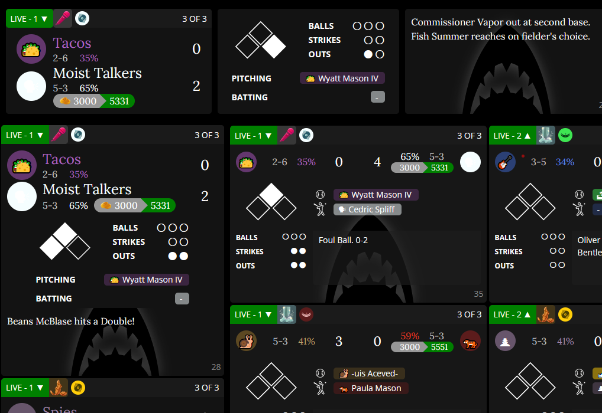
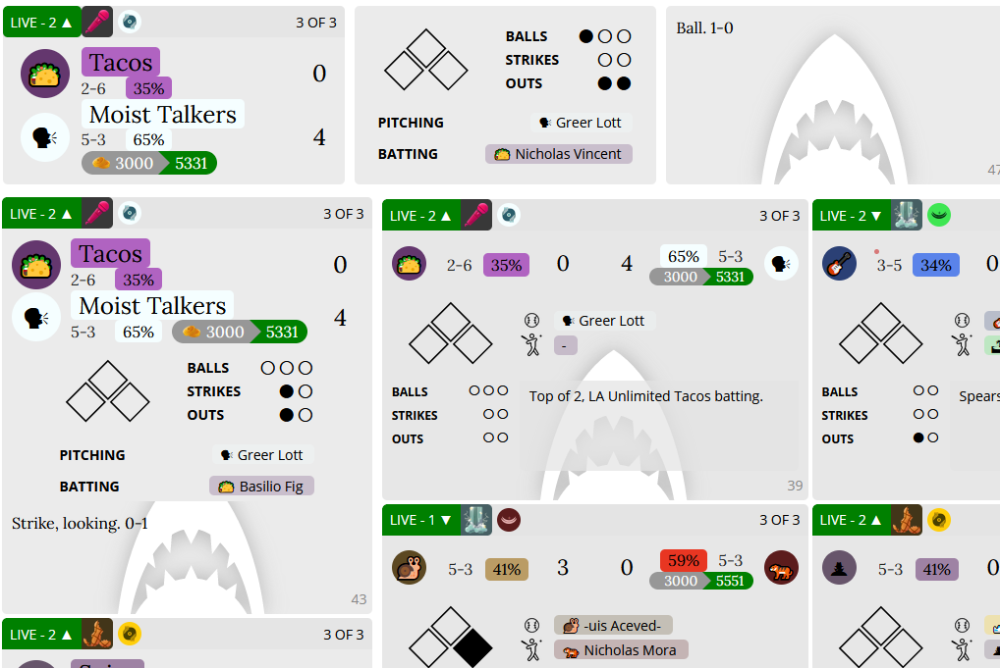
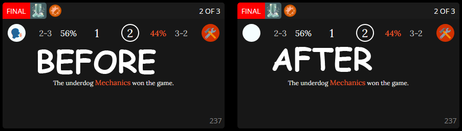

## I made a thing!

I loved big screen blaseball, but it's not really built to show 12 games at a time. So I spent a bit of time reworking a few things, removing some stuff, moving things around, and ended up with what we've got here!

Big thanks to cepheus for [BIG SCREEN Blaseball](https://holmesmr.github.io/Blaseball-Userstyles/#big-screen-blaseball), which you'll need installed to use this userstyle!

## Instructions

* Follow the easy to follow instructions to install [BIG SCREEN Blaseball](https://holmesmr.github.io/Blaseball-Userstyles/#instructions)

* [Click Here to Install Compact BSB](styles/compact-bsb.user.css)

## Troubleshooting

* Try deleting the blaseball styles and reinstalling them! Remember to install [BIG SCREEN Blaseball](https://holmesmr.github.io/Blaseball-Userstyles/#big-screen-blaseball) first, and then [Compact BSB](styles/compact-bsb.user.css)

* I believe there is another commonly used userstyle, `Big Blaseball`, that is not compatible with CompactBSB

## Recent Updates

* Fix for Bracket Layout in the PostSeason (v0.0.18)

* Remove the 'ledger' text from the game event feed (v0.0.19)

* TGB fixed an issue with the mobile layout which broke a thing I was doing so I fixed my thing! (v0.0.20)

* TEAM NAMES ARE BACK! Also some extra compressing in the vertical direction to save a bit more space. (v0.0.21)

## Comparisons

A few screenshots to compare between layouts for normal blaseball, BIG SCREEN Blaseball, and BIG SCREEN Blaseball + Compact BSB

### Normal Blaseball

### BIG SCREEN Blaseball

### BIG SCREEN Blaseball + Compact BSB

## Consumer Contrast

I thought I could help make the CONSUMERS stand out a bit more! After you've got stylish installed, you can [click here to install Consumer Contrast](styles/sharkglow.user.css) which should (hopefully) work with any (or no) userstyles! Works in light mode too!

### Dark Mode

### Light Mode

## Dumb Emoji Fix

I made a thing to fix the Moist Talker's emoji in some browser/OS combinations! [Click here to install it](styles/emoji-fix.user.css).

## Better CoinBoss

[Click here, you coward](styles/better-coinboss.user.css)

## Redacted REDACTED

[Redact the Spies ballpark!](styles/redacted-redacted.user.css)

If you notice any issues feel free to message me at thevdude#6881 on discord and I'll try to take a look at it. :) Stay safe :)
